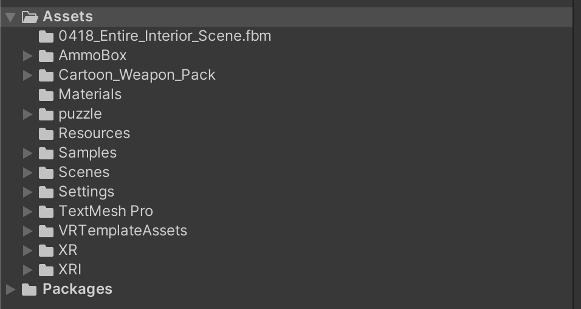

# Heritage Exploration
- Project title: Heritage Exploration in Low Library
- Demo Video: https://www.youtube.com/watch?v=bgYHRs0gJqY

## Team Information
- **Team Name:** Heritage Exploration
- **Members:**
  - Jiaxin Yang - UNI: jy3318
  - Daoxin Chen - UNI: dc3589
  - Zihao Zhang - UNI: zz2887

## Submission Details
- **Date of Submission:** 05/07/2024
- **Development Platforms:** Visual Studio Code, Unity, Meta Quest3
- **Platforms Version (Jiaxin Yang):** 
  - **OS Versions:** macOS Sonoma 14.2.1
  - **Device Names:** Meta Quest3
  - **Unity Names:** 2022.3.25f1

## Special Deployment Instructions
To deploy our application effectively, please follow these steps:

- Environment Setup: Ensure that the Meta Quest 3 device is updated to the latest firmware. Install the necessary development environment for VR development, such as Unity or Unreal Engine, on your computer.
- Dependencies: Download and install the Oculus Integration package from the Oculus Store to ensure compatibility with the Meta Quest 3.
- Installation: Transfer the compiled application file to the Meta Quest 3 using a USB-C cable or via wireless transfer. Ensure that developer mode is enabled on the device for installation.
- Configuration: Adjust the application settings in the VR platform to match the performance requirements, such as resolution and tracking preferences.
- If Unity shows any warning, just ignore them and click "continue" to enter the project.

### GitHub Repo
- The files "/Assets/0418_Entire_Interior_Scene.fbx" and "/Assets/0418_Entire_Interior_Scene.fbm/0418_Entire_Interior_Scene_u0_v0_diffuse.png" is too large to controlled by the GitHub.
- I attached those two files separately in case there is any error in opening them (They are the whole low library building model).

## Target Preparation Instructions
To prepare your target devices for running our application, please follow these guidelines:

- Device Preparation: Charge the Meta Quest 3 headset to full battery before running the application to avoid interruptions.
- Software Update: Check and update the Meta Quest 3 to the latest operating system version to ensure compatibility with our app.
- Play Area Setup: Set up a clear play area of at least 2x2 meters free from obstacles to allow for safe movement while using the VR headset.
- Sensor Calibration: Calibrate the headset and controllers for precise tracking and responsiveness.

## Asset sources
- https://assetstore.unity.com/packages/3d/props/weapons/ammo-box-7701
- https://assetstore.unity.com/packages/3d/props/furniture/table-162871
- The Low Library model and the arrow are built by the team.

## Project directory overview

